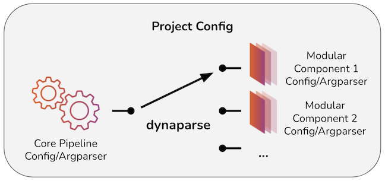

# dynaparse

Enable dynamic configuration of scripts, especially for machine learning applications. In most cases, the "core pipeline" is a training pipeline and the "modular components" are ML models.

<p align="center">
  
</p>

**Note: `dynaparse` is in alpha release for initial testing and is not guaranteed stable.**

# Requirements

- Python 3.6+

# Installation

```
pip install dynaparse
```

# Terminology

- `config` - A (potentially nested) structure containing key/value pairs with type enforcement
- `spec` - A (potentially nested) structure with metadata about parameters in a config. For a given parameter, a spec may contain things like a help string, defaults, a distribution to randomly sample from, a flag indicating whether the parameter is required, etc.

`dynaparse` natively works with json-defined specs.

# Quickstart - config generation

Run `dynaparse --help` at the command line for basic usage.

`dynaparse init <your_filename>` will instantiate both a config file and spec file inferred from the file you reference (yaml and json are supported). These can be used/modified to work with scripts later.

In addition, `dynaparse init <your_import>` will import from a class and perform the same operation. If the class is a `pydantic.BaseModel` (as in `examples/config_compasable.py`), the class (and child class) defaults are used. Otherwise, `dynaparse` expects the class docstring contained in `classname.__doc__` to follow yaml format.

**Once created, any combination of spec and config can be used in scripts as dynamic arguments.**

# Quickstart - dynamic argument parsing

As in `examples/script.py`, inheriting `dynaparse.DynamicArgumentParser` enables the dynamic functionality. Take a look at this basic script to get an idea of how to get started.

Next, follow these steps to get familiar with the workflow:

1. `dynaparse init examples/config_example.json`
2. Edit `_spec_auto.json`:

- Change the categorical parameter's `parameter_type` from `str` to `categorical`
- Add another key in this parameter's dict: `"options": ["option1", "option2", "option3"]`

3. `python -m examples.script --help` (notice the three special arguments added)
4. `python -m examples.script --spec _spec_auto.json --help`
5. `python -m examples.script --spec _spec_auto.json`

- Notice that programmatically, you can access these parsed args with dot notation, e.g. `nested_section.int_parameter_1`

6. Change some values in `_config_auto.json`
7. `python -m examples.script --spec _spec_auto.json --config _config_auto.json`
8. `python -m examples.script --spec _spec_auto.json --nested_section.int_parameter_1 999`
9. `python -m examples.script --spec _spec_auto.json --categorical_parameter_1 option1`
10. `python -m examples.script --spec _spec_auto.json --categorical_parameter_1 option4`

- This should throw an error, as expected (`option4` not in the options list we added previously)
